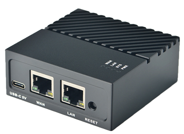
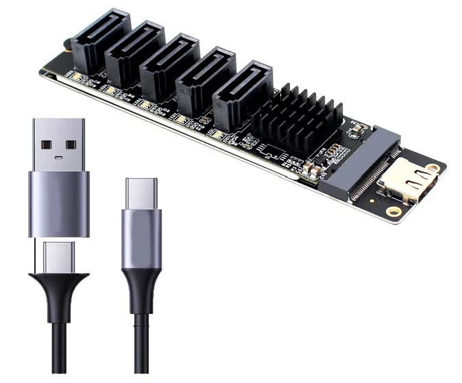
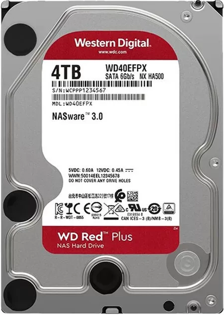

<div align="center">
	
</div>

<h1 align="center">PlainNAS</h1>

<p align="center">Lightweight NAS for Linux • Go backend • Built-in Vue 3 web UI</p>

PlainNAS provides a web interface for file browsing and media management, plus background services for filesystem watching, media scanning/indexing, thumbnails, and LAN sharing.

## What you get

- Web UI (served by the backend)
- File browsing and basic file operations
- Media scan/index + search
- Thumbnails (photo/video)
- LAN discovery via `.local` (Avahi)
- Optional SMB/Samba sharing

## Why PlainNAS (vs image-based NAS OS)

Many NAS products expect you to flash a vendor image to a device/disk/USB drive and then treat it like an appliance. PlainNAS takes a different path: it runs as a Linux service (systemd). If you already have a machine that can run Linux, you can turn it into a lightweight, practical NAS without “reinstalling the world”.

| Topic | PlainNAS | Common competitors (image / NAS-OS appliances) |
| --- | --- | --- |
| Deployment | Install & run on an existing Linux system | Flash an image and run a dedicated NAS OS |
| Hardware / OS lock-in | Works anywhere Linux works (more flexible) | Often tied to specific images, installers, or platforms |
| Time to first use | One-time `install`, then open the web UI | Often feels like setting up a “desktop-like OS” first |
| Web UI philosophy | Simple and direct: files, media, thumbnails, essentials | Often a “platform/app store” UX with many plugins (quality varies) |
| Maintenance model | Clear config + service-oriented ops (fits normal Linux workflows) | More components and layers can mean longer debug chains |
| Portability | Data stays in your Linux filesystem; migration stays straightforward | Platform lock-in can make migration depend on vendor tooling |
| App store / plugins | Intentionally minimal (no plugin platform) | Often a major focus (containers/apps/plugins) |

If you want “no flashing images”, “no platform lock-in”, and a clean web UI that works out of the box, PlainNAS is a good fit.

## Quick start

**Recommended OS:** Ubuntu or Ubuntu-based distributions (Debian, Mint, etc.) are recommended for best compatibility and package support. Other modern Linux distributions may work, but Ubuntu is preferred for smooth installation and updates.

### One-line install (recommended)

```bash
curl -fsSL https://raw.githubusercontent.com/ismartcoding/plainnas/refs/heads/main/install.sh | bash
```

### Install manually

PlainNAS is Linux-only and is typically run as root (it mounts disks and manages system directories).

1) Build the binary

```bash
cd web
bash ./build.sh
cd ..
go build
```

2) Install dependencies + system files (one-time)

```bash
sudo ./plainnas install
```

This will best-effort install required packages (libvips, ffmpeg, samba, avahi) and write:

- `/etc/plainnas/config.toml`
- `/etc/systemd/system/plainnas.service`

3) Install the binary and start the service

```bash
sudo mv ./plainnas /usr/local/bin/plainnas
sudo systemctl enable --now plainnas
```

4) Open the web UI

Default ports come from `/etc/plainnas/config.toml`:

- HTTP: `http://<server-ip>:8080`
- HTTPS: `https://<server-ip>:8443` (TLS cert is auto-generated on first run)

Default UI password (change it): `plainnas`

## Files and directories

```text
/etc/plainnas/
	config.toml        # main configuration
	tls.pem            # generated TLS certificate
	tls.key            # generated TLS private key

/var/lib/plainnas/   # runtime data (DB, indexes, cache)

/mnt/usb*/           # auto-mounted storage slots
```

Storage behavior (high level): on startup PlainNAS reconciles block devices and ensures each filesystem is mounted under a stable `/mnt/usbX` slot, and keeps the mapping stable across reboots/re-plug.

## Developer guide

### Run backend (dev)

```bash
sudo go run main.go install
sudo go run main.go run
```

### Frontend (dev)

The frontend lives in `web/` and uses Yarn (see `web/package.json` `packageManager`).

```bash
cd web
corepack enable
yarn install
yarn dev
```

Production UI build (and copy into Go embed directory):

```bash
cd web
bash ./build.sh
```

### GraphQL code generation

```bash
go env -w GOFLAGS=-mod=mod
go mod tidy
go generate ./internal/graph
```

## Docs

- Storage: [docs/storage.md](docs/storage.md)
- Storage aliases: [docs/storage-alias.md](docs/storage-alias.md)
- Trash: [docs/trash.md](docs/trash.md)
- Tags: [docs/tags.md](docs/tags.md)
- Thumbnails: [docs/thumbnails.md](docs/thumbnails.md)
- Media items: [docs/media-items.md](docs/media-items.md)
- LAN share (SMB/Samba): [docs/samba.md](docs/samba.md)

## Hardware (example)

Tested setup:

- NanoPi R4S (4 GB RAM)
- USB Type-C to SATA 3.0 controller (5-port)
- 2 × SATA hard drives
- OS: [Armbian for NanoPi R4S](https://www.armbian.com/nanopi-r4s/)



